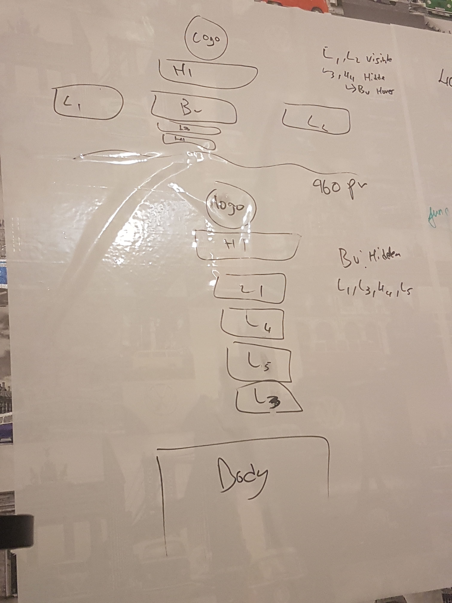
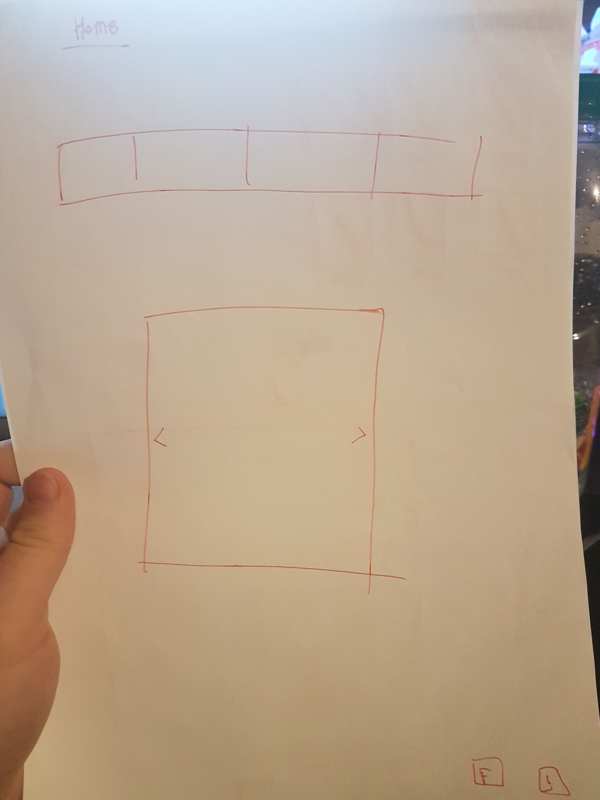
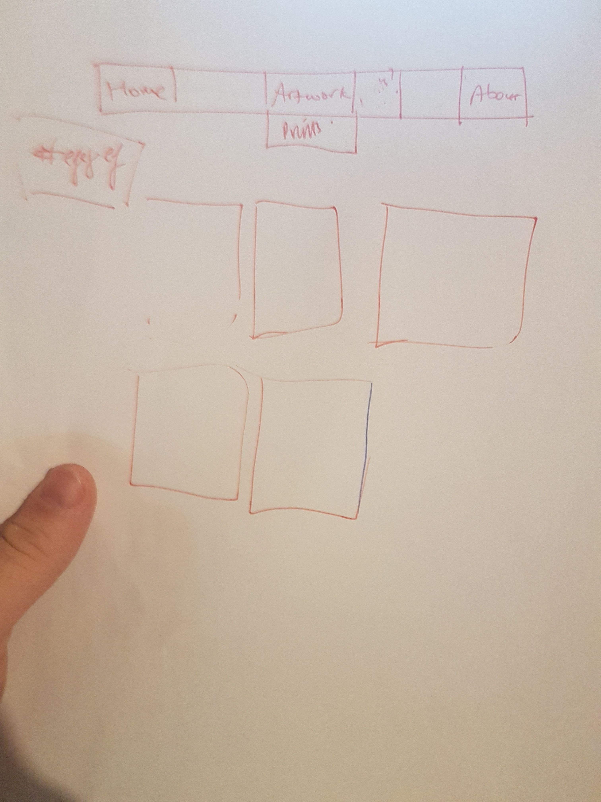
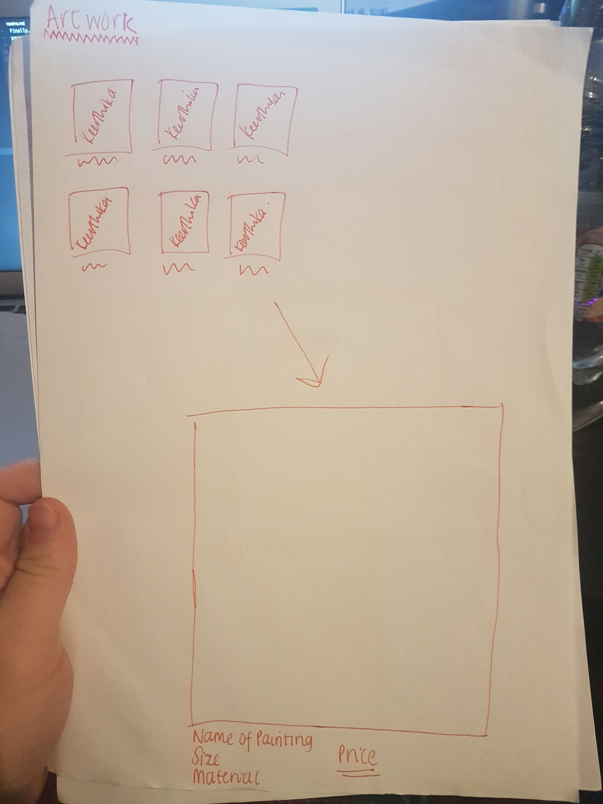

# Front End Web Development Practical Coursework

This project is a website dedicated to artwork by cloudyy.gif, and is used to show the work done by her so far.
## Checklist
- [ ] Introduction
- [x] Designs
- [x] Switching page js
- [x] Slideshow js
- [x] SVG
- [x] API
- [x] Accessibility
- [ ] Issues
- [x] Built With
- [x] Versioning
- [ ] Conclusion
## Design work

## Development
### Switching Pages
This is included in the savepage.js file. It firstly adds all the listeners that will be needed to the elements in the HTML. One of these was to get all the elements with the ID of navItems (Which includes all of the elements from the navigation bar). I added the listener to this to to test for any clicks. When a click in this is detected, it checks to see which of the elements has been selected (the navItems are radio buttons, so only 1 element can be selected at any one time). Using this, it loops through the elements of navItems, and makes all of the sections `display: none;`, apart from the one which represents the selected, which is made `display:block;`.
### Slideshow
This is included in the slideshow.js file. This adds all of the event listeners to the 3 buttons used in this page; previous, pause and next. This then uses `window.onload = showSlides();`. This calls the main function of this file, which is where the picture changes occur. This function loops through all of the slides and makes them invisible. Then a local variable (which holds the value of the current image) is increased, so then this value can be called to get a specific image from the array of slides, and make that image visible. This then has a setTimeout, which specifies a time to wait for, before running the function called, which in this case is itself. For the handlers for the buttons, the next ones clear the current timeout, and then call the main function again, which will promptly change the image. The previous does the same thing, but it has to accommodate for the possibility that the counter could become a negative number, and therefore, I check this possibility. Finally, the pause button checks whether it is currently paused, and if it is, it displays a play button, otherwise it will display a pause button.
## SVG
* I used an SVG which was found [here](https://commons.wikimedia.org/wiki/Category:SVG_cloud_icons).
* I used and adapted the animate from [here](http://www.tutorialized.com/tutorial/Create-a-Gently-Swaying-Image-With-CSS3-Animation/85877).

## API
I am using 2 api's on my website; Flickr and Wikipedia. In the about tab, there is a section which is dedicated to inspirations. Using this information, I pull in images by this artist (Vincent Van Gogh), and it displays these images on the page. I then pull in a Wikipedia link to a page about him, and then displays it as an anchor tag on the website.

## Accessibility
[Accessibility - W3C - World Wide Web Consortium](https://www.w3.org/standards/webdesign/accessibility). I used this site to help me understand and implement more accessibility into my website.
My site has implemented it by having Alternative text for images. This is for screen readers, so it can easily tell the user what is being displayed.

## Issues

## Built With
These are what I used to develop this website.
* [Atom](https://atom.io) - Text editor
* [Github](https://github.com) - Version Control
* [Safari](https://support.apple.com/en_GB/downloads/safari) - Browser 1
* [Chrome](https://www.google.com/chrome/browser/desktop/index.html) - Browser 2

## Versioning

I used Git for version control. This is the world's leader in version control.

## Authors

My Github -> [dosullivan557](https://github.com/dosullivan557)
Daniel O'Sullivan
